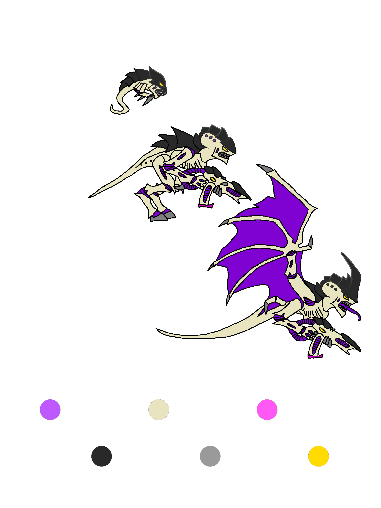
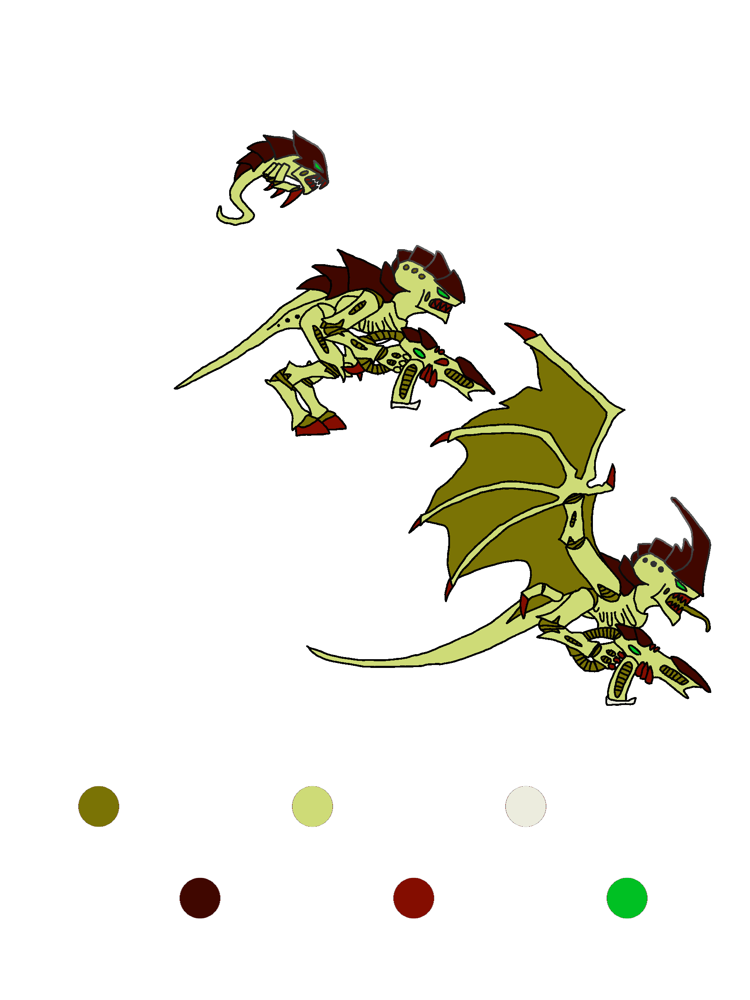
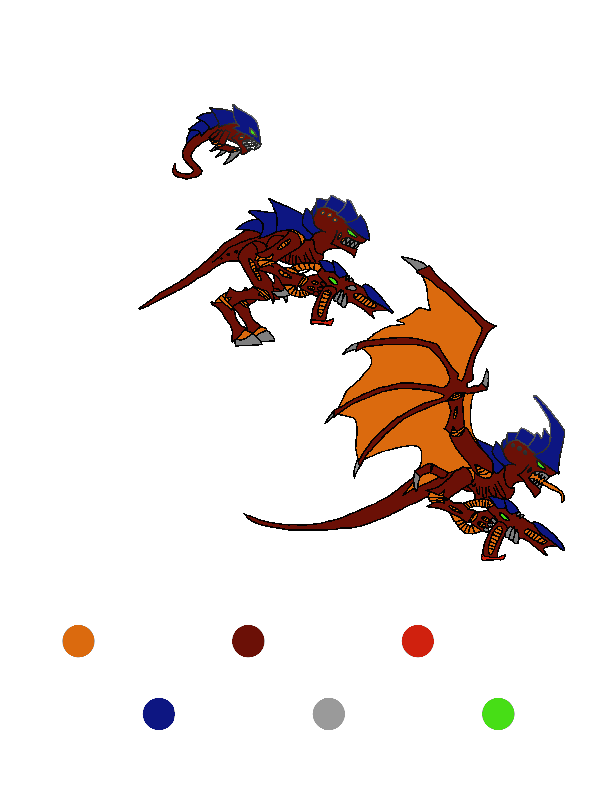
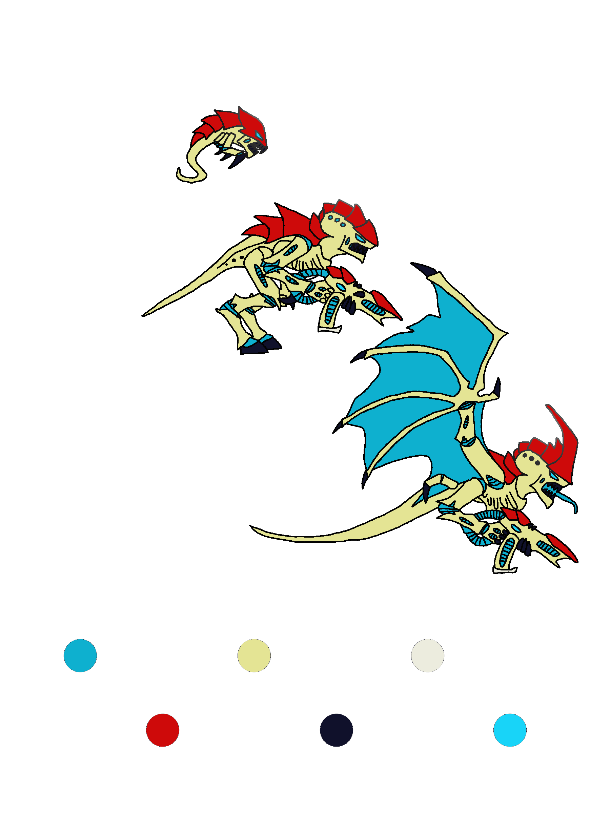

# 40k-palettes: digital army canvas

 

# SUMMARY

Hot swappable palettes for simulating army colors.

# EXAMPLES

## Arachne

## Behemoth

## Kraken

See [examples](examples) for more inspiration.

# RECOMMENDED

* [GIMP](https://www.gimp.org/)

# ABOUT

Our palettes collections are designed for a singular quick and easy action: Select/Replace By Color.

Image layers include:

* Colors
* White zenithal primer
* Black primer

# FORK

We invite you to customize the images.

Use GIMP, Photoshop, and other image tools to customize miniature army colors. A fun way to explore color spaces, before committing real paint to physical models!
